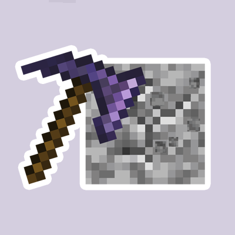

# PickBlockButForModdedTools

This is an update to the Forge Pick Block But For Tools mod to include tools from other mods.

It allows the Player to use the Pick Block like action to instead pick the tool that best breaks or saves the block. This action does not override the main Minecraft Pick Block action

To use the break feature hold "B" (default key binding) and middle click on the block to select the best breaking tool (prioritizes fortune).

To use the "save" feature hold "V" (default key binding) and middle click on the block to select the best silk touch tool.

To quick select the pickarang or flamerang press "Y" (default key binding)

To quick select the atomic disassembler press "X" (default key binding)

## Features
- Selects paxel for appropriate blocks
- Selects pickaxe for stone like blocks
- Selects axe for wood like blocks
- Selects shovel for dirt like blocks
- Selects hoe for leave like blocks
- Selects shears for wool like blocks and vine like blocks
- Save hotkey chooses best silk touch tool

## Mods Integrated
- Quark
- Mekanism

## Dependencies
- minecraft [1.18, 1.19]